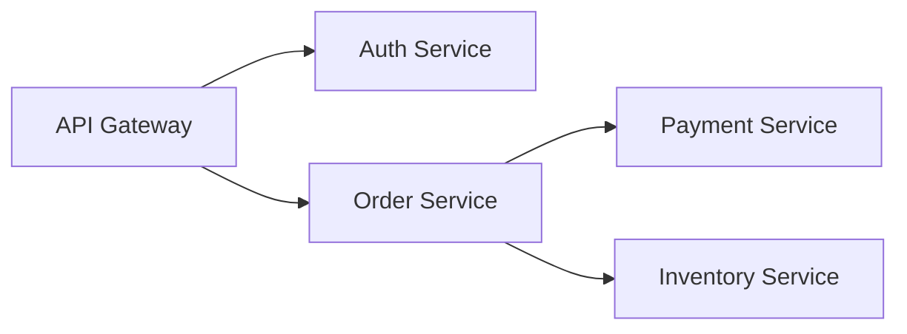

# 架构设计阶段规则（rules/stage-arch-design.md）

> **本文档是架构设计阶段（stage: arch）的可调规则，仅在此阶段携带，阶段结束后卸载。**
>
> 加载策略：`on_prompt_receive` hook 检测当前阶段为 arch 时加载。

---

## 1. 阶段目标

把 PRD 转化为可实施的技术方案——产出 ADR + 模块设计 + 接口契约 + 数据模型，作为编码阶段的契约。

进入条件：需求分析阶段（req）已 completed
退出条件：产出清单全部通过（详见 §5）

---

## 2. 必做产出

按 WORKFLOW.md §5.1 / COMMANDS.md §3.5，本阶段产出：

| 产出 | 路径 | 必选 | 规范 |
|------|------|------|------|
| ADR（架构决策记录） | `docs/decisions/ADR-<NNN>-<slug>.md` | ✅ | 详见 §3.1 |
| 模块设计文档 | `docs/design/<feature>-design.md` 或 `docs/component/cards/<module>.md` | ✅ | 含模块图 + 模块职责 + 模块间依赖 |
| 接口契约 | `docs/design/api-<feature>.md` 或 `docs/api/<feature>-openapi.yaml` | ✅ | OpenAPI 3.0 / proto / GraphQL schema |
| 数据模型 | `docs/design/data-model-<feature>.md` | ❌ 可选 | ER 图 + 字段说明 + 索引策略 |
| 设计版本 | `docs/design/<feature>.version` | ✅ | SemVer，初始 0.1.0 |

---

## 3. ADR 规范

### 3.1 ADR 必含章节

参考 `docs/decisions/ADR-001-plugin-vs-project-boundary.md`：

```markdown
---
title: <决策标题>
type: adr
status: active
decided_at: <YYYY-MM-DD>
deciders: [<决策者>]
---

# ADR-<NNN>: <决策标题>

## 背景
<为什么需要这个决策？现状如何？>

## 决策
<决策内容——简洁陈述，一句话能说清最好>

## 候选方案
| 方案 | 优点 | 缺点 | 结论 |
|------|------|------|------|
| A    | ...  | ...  | 拒绝 |
| B    | ...  | ...  | 采纳 |

## 影响
### 代码影响
### 行为变化
### 性能影响
### 安全影响

## 回滚
<若决策错误，如何回滚？成本？>

## 关联
- 上游需求：
- 下游实现：
- 相关 ADR：
```

### 3.2 ADR 编写时机

按 `docs/decisions/README.md` §"何时写 ADR"：

- 重大架构决策（影响多个组件）
- 有多个候选方案需要权衡
- 决策一旦做出难以回滚
- 团队需要对决策达成共识

### 3.3 ADR 编号

- 从 `docs/decisions/` 扫描最大编号 +1
- 文件名：`ADR-<NNN>-<slug>.md`，slug 用 kebab-case
- 一旦发布永不修改内容（除非修正笔误）
- 状态变更（active → deprecated）通过新增 ADR 实现

---

## 4. 模块设计规范

### 4.1 模块拆分原则

- **单一职责**：每个模块只负责一类业务（如 auth / payment / user）。
- **高内聚低耦合**：模块内部高内聚，模块间通过明确接口低耦合。
- **≤ 9 个模块**：超过 9 个应再拆分上层（CONVERGENCE.md §2.4 / COMMANDS.md §3.3）。
- **模块边界清晰**：每个模块有明确职责文档（`docs/component/cards/<module>.md`）。

### 4.2 模块设计卡片（每个模块一份）

按 REQUIREMENTS.md §5.5：

```markdown
---
title: <模块名> 设计卡片
type: card
version: 1.0.0
status: active
---

# <模块名> 设计卡片

## 目标
<这个模块解决什么问题>

## 大纲
<实现思路与关键决策>

## 对外接口
- 输入：xxx
- 输出：xxx
- 暴露的工具：xxx
- 依赖：xxx

## 边界
<不做什么>
```

### 4.3 模块依赖图

- 用 Mermaid 或 PlantUML 画模块依赖图
- 标注同步 / 异步调用关系
- 标注数据流向（哪些模块读 / 哪些写）



### 4.4 接口契约

- REST API 用 OpenAPI 3.0
- gRPC 用 proto3
- GraphQL 用 GraphQL schema
- 事件用 AsyncAPI 或 CloudEvents

每个接口必须含：
- 路径 / 方法
- 入参（类型 + 校验规则）
- 出参（成功 + 错误）
- 鉴权要求
- 限流策略
- 版本号

---

## 5. 产出检查（on_stage_exit hook）

`on_stage_exit` hook 按 WORKFLOW.md §5.2 检查：

1. **文件存在性**：
   - 至少 1 个 ADR 文件
   - 模块设计文档存在
   - 接口契约文件存在
2. **文件非空**：size > 0
3. **ADR 含必含章节**：背景 / 决策 / 候选方案 / 影响 / 回滚 / 关联
4. **模块设计卡片格式**：含目标 / 大纲 / 对外接口 / 边界四章节
5. **接口契约可解析**：OpenAPI / proto / GraphQL schema 语法正确
6. **模块数量 ≤ 9**：超过报 warning（不阻塞，提示拆分）
7. **不捏造检查**：扫描 `{{TODO:xxx}}` 占位数量，> 5 个时 warning

任一失败则阻塞进入下一阶段。

---

## 6. 阶段内禁止行为

### 6.1 禁止写实现代码

- 本阶段**不写实现代码**——只写设计文档与接口契约。
- 可写伪代码 / 类型定义 / 接口签名，但不创建 `src/` 下实现文件。
- 类型定义可作为接口契约的一部分（如 proto 文件）。

### 6.2 禁止跳过 ADR

- 重大决策必须有 ADR——不允许"口头讨论决定"。
- 没有候选方案的决策不算决策（直接说"用 X"不算）。
- 没有回滚方案的 ADR 不算完成。

### 6.3 禁止过度设计

- 模块数 ≤ 9（CONVERGENCE.md §2.4）
- 不为"未来可能的需求"提前设计——YAGNI（You Aren't Gonna Need It）
- 不引入未使用的依赖

### 6.4 禁止打破现有契约

- 修改已有接口契约必须 bump 版本号
- Breaking changes 必须有迁移方案
- 不向后兼容的变更必须 ADR 说明

---

## 7. 阶段内推荐实践

### 7.1 C4 模型分层

按 REQUIREMENTS.md §4.3（合并 C4-MODEL.md）：

| 层级 | 视角 | 文档位置 |
|------|------|---------|
| Context | 系统与外部系统的关系 | `docs/design/context-<feature>.md` |
| Container | 系统内主要容器（服务 / DB / 队列） | `docs/design/container-<feature>.md` |
| Component | 单个容器内的组件 | `docs/component/cards/<module>.md` |
| Code | 类 / 函数级（按需，通常不写） | 代码注释 |

### 7.2 设计评审

- 重大 ADR 必须团队评审通过
- 模块设计必须至少 1 人评审
- 接口契约必须前后端双方确认

### 7.3 风险评估

- 标记技术风险：未知技术 / 性能瓶颈 / 第三方依赖
- 标注业务风险：法规 / 合规
- 每个风险列缓解措施 + fallback 方案

### 7.4 性能预估

- 关键接口预估 QPS / 响应时间
- 数据库预估数据量 / 索引策略
- 缓存策略：哪些数据缓存 / TTL / 失效策略

---

## 8. 与其他阶段的衔接

### 8.1 进入编码（coding）的前置

- ADR 已通过产出检查（§5）
- 模块设计已确认
- 接口契约已确认
- TODO 标记已声明 `[depends]` 关系（COMMANDS.md §3.4）

### 8.2 与任务型命令的关系

- `/design-new` / `/design-module` / `/design-bridge` / `/design-topdown` / `/design-bottomup` 内部走 arch 阶段子集
- 任务型命令在 arch 阶段也必须遵循本规则
- 产出命名按 CONVERGENCE.md §7.14：

| 命令 | 产出路径 |
|------|---------|
| `/design-new <desc>` | `docs/design/<feature-slug>-design.md` |
| `/design-module <name>` | `docs/component/cards/<module-name>.md` |
| `/design-bridge <a> <b>` | `docs/design/bridge-<a>-<b>.md` |
| `/design-topdown <desc>` | `docs/design/topdown-<feature-slug>.md` |
| `/design-bottomup <desc>` | `docs/design/bottomup-<feature-slug>.md` |

### 8.3 与标记系统的关系

- 本阶段声明 TODO 标记间的 `[depends]` 依赖关系
- 依赖图必须无环（DAG），hook 在 `tool_call_before` 检查
- 标记 `[agent:backend]` 等归属字段在此阶段声明

---

## 9. 阶段状态变更

按 WORKFLOW.md §4.2：

| 命令 | 状态转换 | 前置检查 |
|------|---------|---------|
| `/workflow advance` | in_progress → completed → 下一阶段 pending | 产出检查通过 |
| `/workflow goto coding` | any → coding in_progress | 本阶段 completed 或 skipped |
| `/workflow goto review` | any → review in_progress | 本阶段 completed（不允许 skip） |

完成后自动进入编码实现阶段（coding），加载 `rules/stage-coding.md`。
